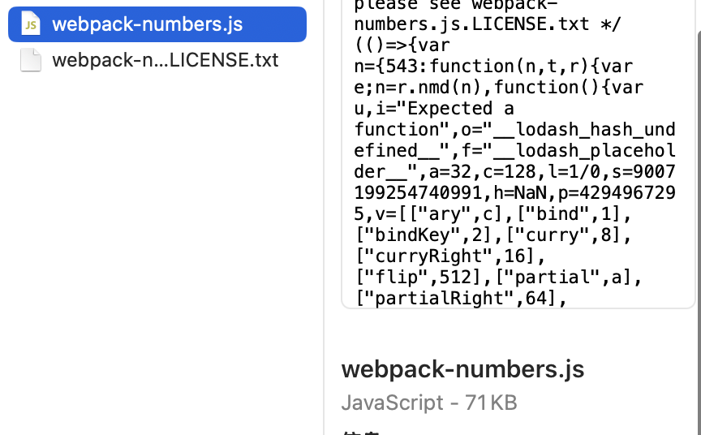
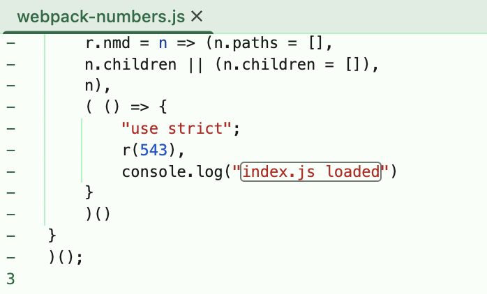
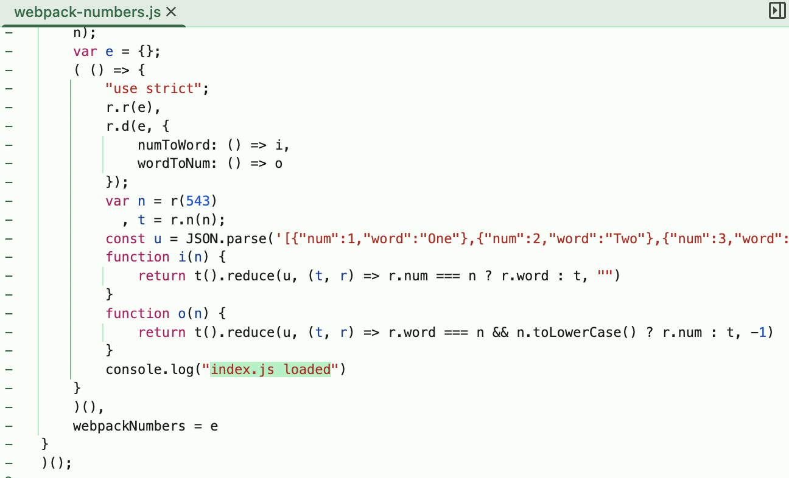
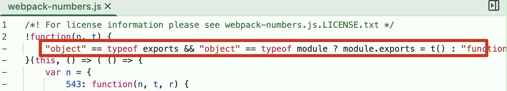

> 查看 https://webpack.js.org/guides/author-libraries/

## 项目目标
允许用户将数字 1 到 5 从数字表示转换为文本表示，反之亦然，例如将 2 转换为“two”。

## 注意
- 将 lodash 安装为 devDependencies 而不是 dependencies ，因为我们不想将其捆绑到我们的库中，否则我们的库很容易膨胀。

## 版本变化

### v0.0.1

```javascript
module.exports = {
  entry: './src/index.js',
  output: {
    path: path.resolve(__dirname, 'dist'),
    filename: 'webpack-numbers.js',
  },
};
```

构建产物（体积大小 71KB）
除了 webpack-numbers.js 以外，还有一个文件：webpack-numbers.js.LICENSE.txt
构建出来的js文件没有 numToWord() 和 wordToNum()，也没有从 ref.json 引入的变量，难道是被“树摇”掉了？



### v0.0.2

将入口点公开为 webpackNumbers ，以便用户可以通过脚本标签使用它

```javascript
module.exports = {
  entry: './src/index.js',
  output: {
    path: path.resolve(__dirname, 'dist'),
    filename: 'webpack-numbers.js',
    // 将入口点公开为 webpackNumbers ，以便用户可以通过脚本标签使用它
    library: "webpackNumbers", // <-----新增了这一行
  },
};
```

构建产物（体积大小 71KB）



### v0.0.3

支持多种模式使用

```javascript
module.exports = {
  entry: './src/index.js',
  output: {
    path: path.resolve(__dirname, 'dist'),
    filename: 'webpack-numbers.js',
    
    // !!!! 以下为修改内容 !!!!
    // 构建产物作为一个库导出，并支持多种模块定义方式（UMD，包括CommonJS、AMD和作为全局变量）
    globalObject: 'this',
    library: {
      name: 'webpackNumbers',
      type: 'umd',
    }
  },
};
```

构建产物（体积大小 72KB）

圈出来这里就是 UMD 对各种模块化做的兼容。



### v0.0.4

使用 `externals` 将 lodash 外部化，减小构建产物体积：

```javascript
module.exports = {
  // 外部化 Lodash
  externals: {
    lodash: {
      commonjs: 'lodash',
      commonjs2: 'lodash',
      amd: 'lodash',
      root: '_' // 全局变量
    }
  }
}
```

构建产物的体积大小只有 1KB。

